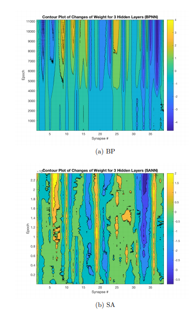

### Sarah's Code for her Master's thesi


- BPNN trains a variable sized neural newtork using the backpropagation algorithm. 
- SANN trains a variable sized neural network using simulated annealing to find optimal weights. 


This work was part of my [Master Thesis in Aerospace Engineering](https://etda.libraries.psu.edu/files/final_submissions/15259)


```
@mastersthesis{NNSAthesis,
author       = {Sarah Aguasvivas Manzano}, 
title        = {Performance and Parsimony in Training Deep Neural Networks},
school       = {The Pennsylvania State University},
year         = 2017,
note      = {https://etda.libraries.psu.edu/catalog/13814sia5396},
month        = 7,
}
```

One of the most important plots in this thesis is the difference in optimization paths between Simulated Annealing and Backpropagation in training a neural network to learn the same dataset and with  the exact same architecture. 




